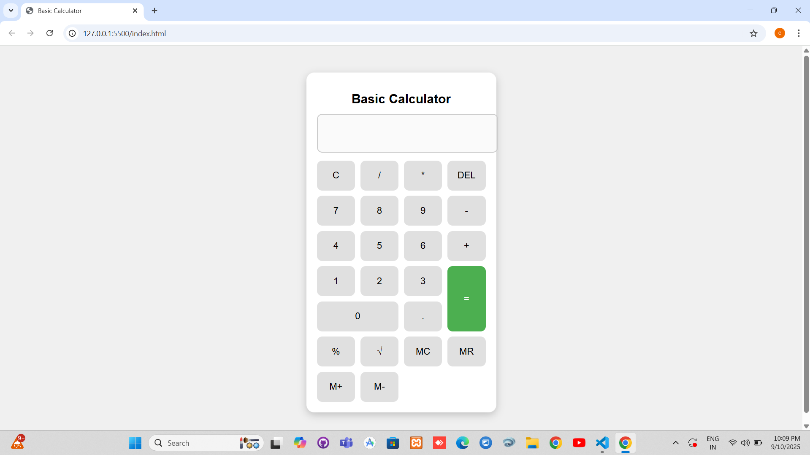

# 🧮 Basic Calculator

A simple **Basic Calculator** built using **HTML, CSS, and JavaScript**.  
Supports arithmetic operations, percentage, square root, memory functions, and keyboard input.  
This project was created as part of my internship assignment to practice front-end development skills.

---

## 🌐 Live Demo
👉 [Click here to use the Calculator](https://chandana351.github.io/basic-calculator/)

---

## 🚀 Features
- Perform basic arithmetic operations: addition, subtraction, multiplication, and division  
- Percentage (%) calculation  
- Square root (√) function  
- Memory functions:  
  - **MC** → Memory Clear  
  - **MR** → Memory Recall  
  - **M+** → Add to Memory  
  - **M-** → Subtract from Memory  
- Error handling (division by zero, invalid inputs)  
- Keyboard support:  
  - Numbers and operators (+, -, *, /)  
  - `Enter` → Equals  
  - `Backspace` → Delete last character  
  - `Esc` → Clear  
  - `%` → Percentage  

---

## 🛠 Tech Stack
- **HTML** → Structure  
- **CSS** → Styling & Layout  
- **JavaScript** → Functionality  

---

## 📂 Files in this Repository
- `index.html` → Calculator structure  
- `styles.css` → Styling & design  
- `script.js` → Calculator logic (with comments)  
- `README.md` → Documentation (this file)  
- `screenshot-new.png` → Project screenshot  

---

## ▶️ How to Run Locally
1. Clone this repository or download the ZIP.  
   ```bash
   git clone https://github.com/chandana351/basic-calculator.git
2. Open the index.html file in your browser.
3. Start calculating 🎉

---
## ✨ Screenshot
Here’s how the calculator looks:  


